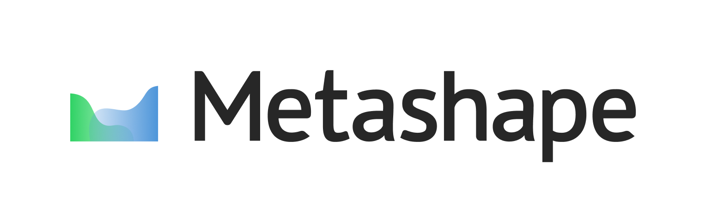
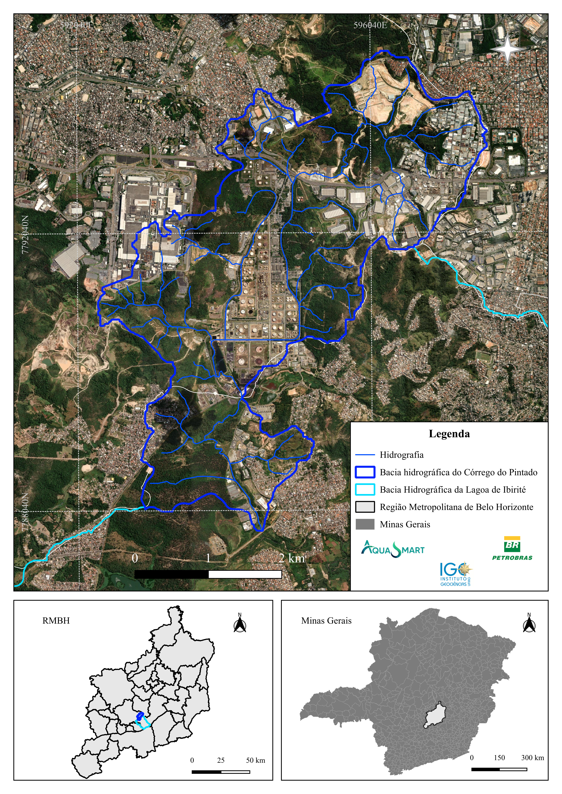
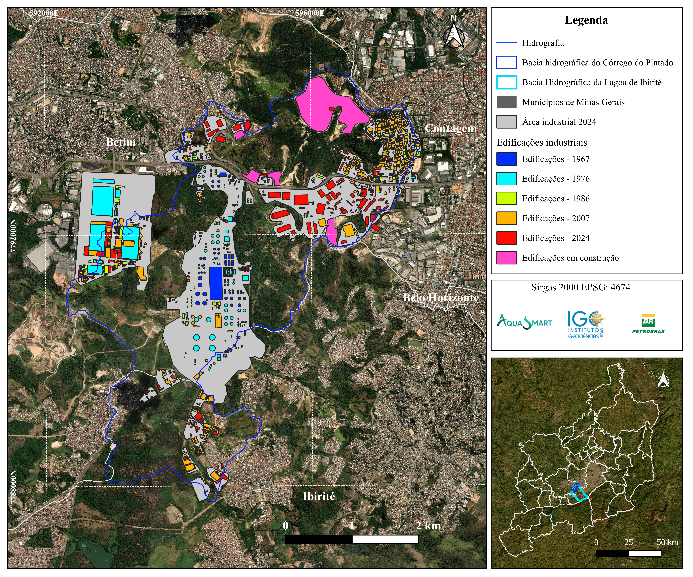
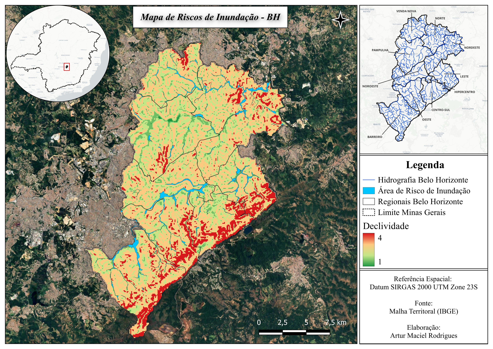
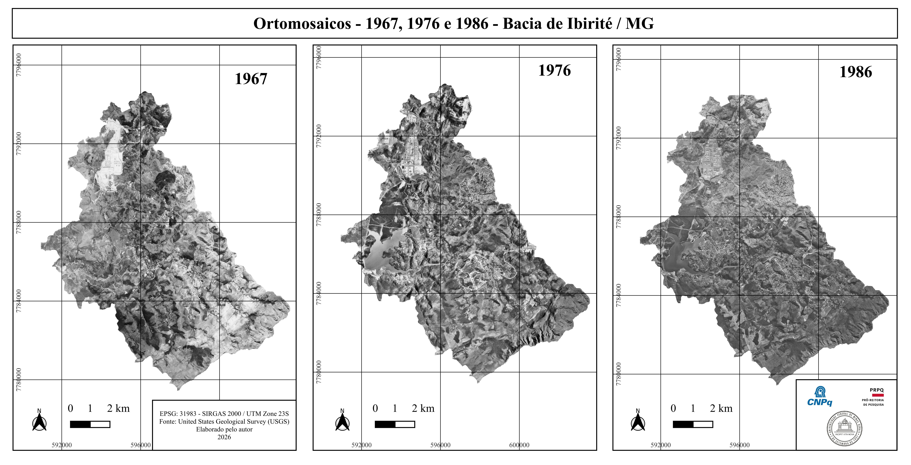
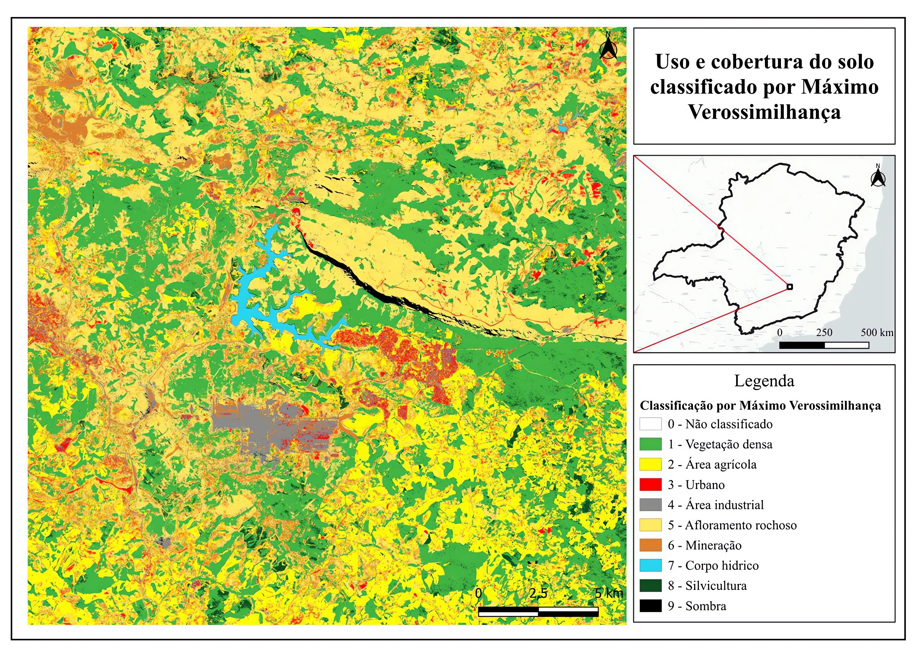
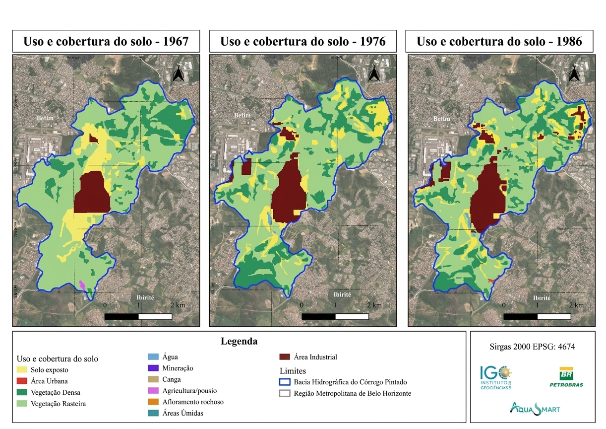

## Artur Maciel Rodrigues

Me chamo Artur Maciel Rodrigues, tenho 20 anos e sou natural de Betim/MG. Atualmente estou cursando Geografia na Universidade Federal de Minas Gerais (UFMG). Atuei em duas bolsas de Iniciação Científica e um projeto voluntário, voltado à área de geoprocessamento, fotogrametria e sensoriamento remoto. Possuo grande interesse nas linhas de pesquisas referentes ao tema de Geotecnologias, Modelagem Ambiental, Geoestatística e Hidrogeografia.

**Linkedin**: www.linkedin.com/in/artur-m-r            
**Lattes**: https://lattes.cnpq.br/7860717780387506

# Softwares e tecnologias

 

---

# Portfólio de Mapas 

Produção de mapas temáticos desenvolvidos a partir de técnicas de
Geoprocessamento, Sensoriamento Remoto e Cartografia.

### Localização - Bacia do Córrego do Pintado/MG

  

### Edificações do Complexo Industrial da bacia do Pintado

  

### Susceptibilidade à Inundações na cidade de Belo Horizonte/MG

  

### Ortomosaicos Bacia de Ibirité 

  

Desenvolvidos no software *Agisoft Metashape*, e posteriormente processado no Qgis 3.40

### Uso e Cobertura do solo em Ouro Branco/MG

  

Desenvolvido através de classificação supervisionada de imagens pelo plugin *Semi-Classification Plugin* do QGIS

### Uso e Cobertura da bacia do Pintado

  

